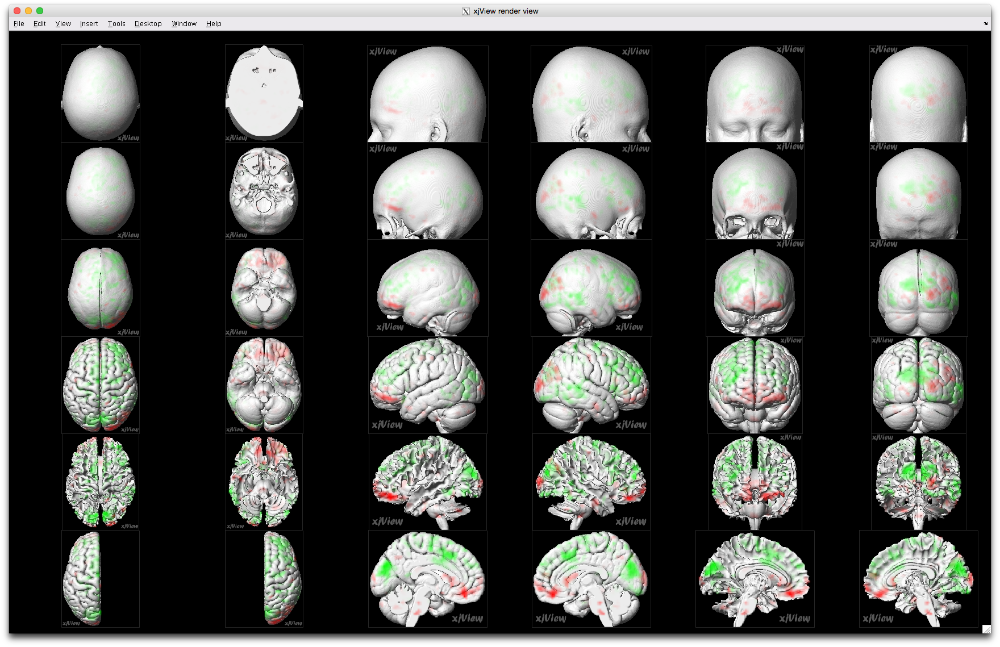
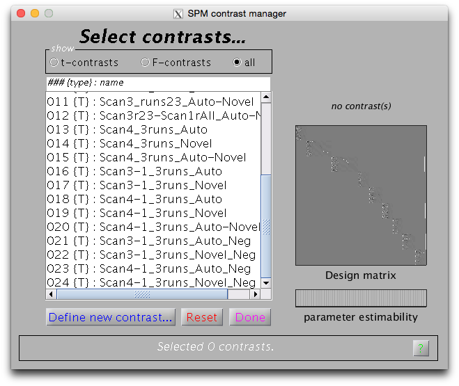
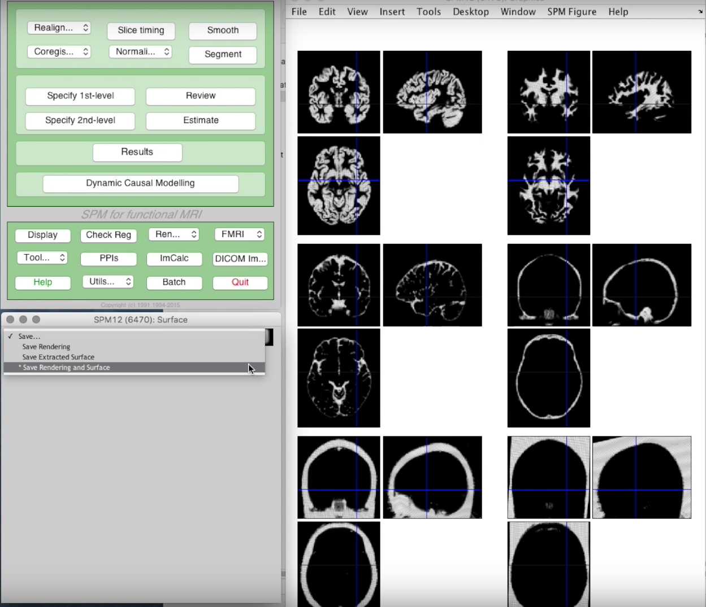
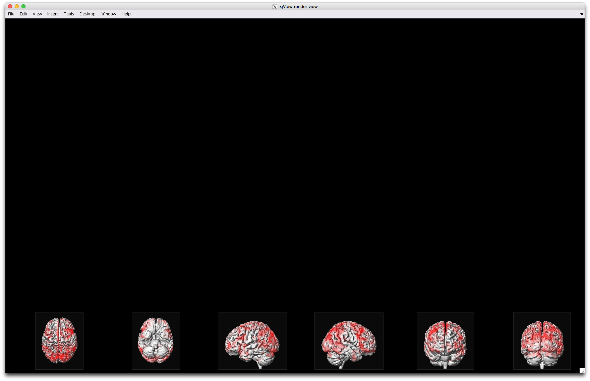
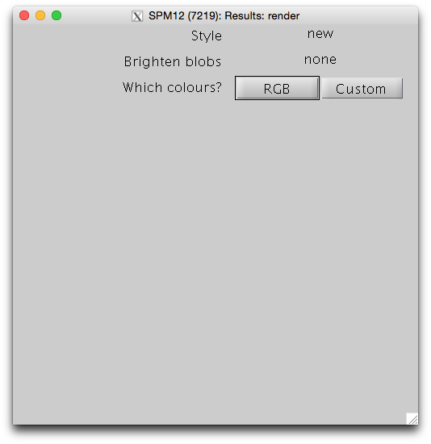
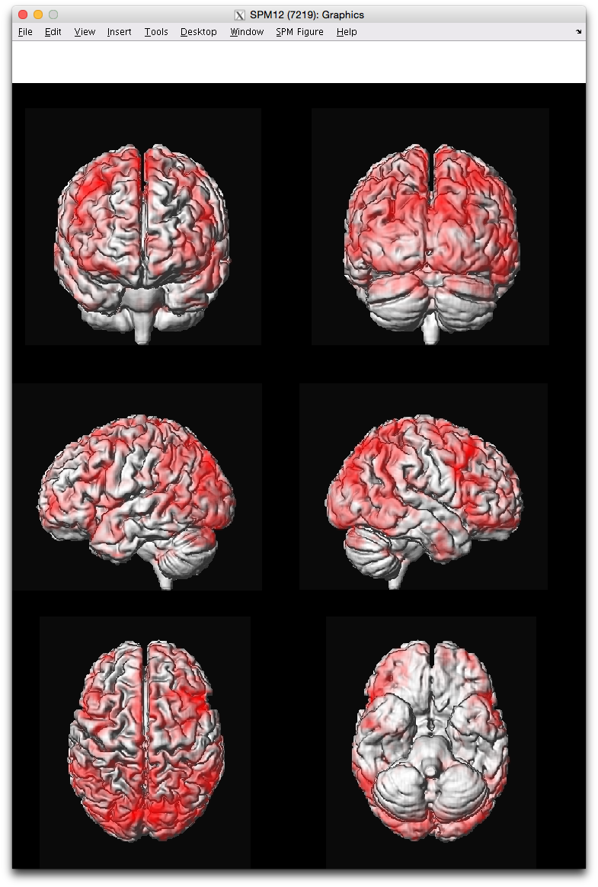

### xjview Subject-specific render
5/4/2018, 10:25:51 AM

#### Problem 1: visualizing postive/negative activation /w Dr. D Task study
`xjview` `Render View` function only uses average healthy brain for rendering. The problem becomes when subject's own brain has atrophies and needed to be rendered with his own brain. Below shows the default render from `xjview`.



Another problem encountered was the loaded `spmT_0019.img` has continuous values instead of binary values.
> /PCN/Sean_Working/FirstLevel/DrD_scan1_noDummy_ReStart/AutoBio_noDummy_Scan134_2cond_masked/spmT_0019.img,1

_==>_ Needed to **save** the Postive and Negative activations as **binary masks**. However, there is no easy way of saving **all clusters** in `xjview` so instead I had to use `spm8` to save the binary masks. Yet, `spm8` cannot visualize **negative activations**. Therefore, I had to again create negative contrasts for Dr.D's Task study so that I can save both **postive & negative** contrasts in `spm8` and then render them separately in `xjview`. The new **negative** contrasts generated is posted below.



#### Problem 2: visualizing postive/negative activations on Dr.D's own brainGraph
The next challenge is how to render Dr. D's own brain in `xjview` `Render View`. I've reached out to the Google help forum for `xjview` and found a thread mentioning this new rendering. After asking my subject-specific brain rendering, the author asked me to contact the one who supplied this update directly, which I did but also got no reply (see thread response below).

After searching on the web, I found Dr. Justin O'Brien's great `SPM12` tutorials on Youtube. Within it,
- Section 12 `Image Segmentation` (https://youtu.be/_SSzN9KL_qw), he used the `Segmentation` function to segment out the _grey/white/CSF/etc._ tissues in either `native space` or `warped space` .
- Sectin 13 `Extract surface`(https://youtu.be/HmCCtWvqMJQ), he used the `Render... > Extract Surface` to save rendering and surface which for Dr.D's case they are files `render_c1t1spgr_208.mat` & `c1t1spgr_208.surf.gii` for **Native Space** and `render_mwc1t1spgr_208.mat` & `mwc1t1spgr_208.surf.gii` for **Warped Space**. Snapshots from `spm12` as well as Dr.D's anatomical files operated on are posted below.



#### Problem 3: inserting Dr.D's own render brain in xjview
The last piece of puzzle is to render the Task activation on Dr.D's own rendered brain as we've defined in **Problem 2** above. All we need now is to copy the **warped** `spm12` rendered brain `render_mwc1t1spgr_208.mat` to the `xjview` folder and rename it as `xjview_render.mat` _Note: do remember to backup the orginal `xjview_render.mat` so the default view can be loaded back._

`cp render_mwc1t1spgr_208.mat /SPM12/spm12_R7219/toolbox/xjview`

` mv xjview_render.mat xjview_render.mat.bakup`

`mv render_mwc1t1spgr_208.mat xjview_render.mat`



#### Final render: using SPM12 instead
While we've eventually hacked `xjview` to use Dr.D's own brain to render, it would be nice to view the render in `SPM` with the stacked column way. So back in `SPM12`, we choose `Render... > Display` and select the **warped rendered brain** `render_mwc1t1spgr_208.mat` for Dr.D as we had segmented in **Problem 2**. Afterwards, you can define how many sets of `SPM.mat` you want to include as well as the colormap which are very useful compared to `xjview`!!

>/PCN/Sean_Working/Subjects/DrD_scan1_noDummy_ReStart/anatomy



And our final render for poster or publication!!




#### Dr.D anatomical folder file list
```
[sean@ anatomy]$ pwd -P
/PCN/Sean_Working/Subjects/DrD_scan1_noDummy_ReStart/anatomy
[sean@ anatomy]$ ls -la
total 261448
drwxr-xr-x. 2 tehsheng users     4096 Apr 19 13:34 .
drwxr-xr-x. 4 tehsheng users     4096 Nov  2  2017 ..
-rw-r--r--. 1 tehsheng users 13631840 Apr 18 10:55 c1t1spgr_208.nii
-rw-r--r--. 1 tehsheng users  9450702 Apr 18 11:06 c1t1spgr_208.surf.gii
-rw-r--r--. 1 tehsheng users 13631840 Apr 18 10:55 c2t1spgr_208.nii
-rw-r--r--. 1 tehsheng users 13631840 Apr 18 10:55 c3t1spgr_208.nii
-rw-r--r--. 1 tehsheng users 13631840 Apr 18 10:55 c4t1spgr_208.nii
-rw-r--r--. 1 tehsheng users 13631840 Apr 18 10:55 c5t1spgr_208.nii
-rw-r--r--. 1 tehsheng users 13631840 Apr 18 10:55 c6t1spgr_208.nii
lrwxrwxrwx. 1 tehsheng users      122 Oct 23  2017 ht1overlay_51slfunc.nii -> /anatomy/t1overlay_51slfunc/ht1overlay_51slfunc.nii
-rw-rw-r--. 1 tehsheng users  6685024 Sep 22  2017 ht1overlay.nii
-rw-r--r--. 1 tehsheng users  8492132 Apr 18 10:55 mwc1t1spgr_208.nii
-rw-r--r--. 1 tehsheng users  3886702 Apr 18 11:07 mwc1t1spgr_208.surf.gii
-rw-r--r--. 1 tehsheng users  8492132 Apr 18 10:55 mwc2t1spgr_208.nii
-rw-r--r--. 1 tehsheng users  8492132 Apr 18 10:55 mwc3t1spgr_208.nii
-rw-r--r--. 1 tehsheng users  8492132 Apr 18 10:55 mwc4t1spgr_208.nii
-rw-r--r--. 1 tehsheng users  8492132 Apr 18 10:55 mwc5t1spgr_208.nii
-rw-r--r--. 1 tehsheng users  8492132 Apr 18 10:55 mwc6t1spgr_208.nii
-rw-r--r--. 1 tehsheng users 21971344 Apr 18 11:05 render_c1t1spgr_208.mat
-rw-r--r--. 1 tehsheng users 14195216 Apr 18 11:06 render_mwc1t1spgr_208.mat
lrwxrwxrwx. 1 tehsheng users      105 Oct 23  2017 t1spgr_208.nii -> /anatomy/t1spgr_208/t1spgr_208.nii
-rw-r--r--. 1 tehsheng users  6256312 Apr 18 10:53 t1spgr_208_seg8.mat
-rw-r--r--. 1 tehsheng users 27263328 Oct 18  2017 t1spgr.nii
-rw-r--r--. 1 tehsheng users  9258328 Apr 19 13:34 w_biasMed_Cutoff100_t1spgr_208.nii
-rw-r--r--. 1 tehsheng users  9258328 Apr 18 11:21 wt1spgr_208.nii
-rw-r--r--. 1 tehsheng users 25475692 Apr 19 13:34 y_t1spgr_208.nii
```

#### xjview google help forum
https://groups.google.com/forum/?hl=en#!topic/xjview-discuss-group/DJYDHV3O3e4
```
Xu Cui	10/11/17

The main new feature is higher resolution render view. This update is brought to you by Dr. Weiwei Men (email: wmen AT pku.edu.cn) from Center for Magnetic Resonance Imaging Research, Peking University, China. Weiwei has been using xjView for 10 years. He noticed that the image resolution of the render view in xjView 9 is low, and took the effort to create a new view using a high resolution template (ICBM152_asys_2009C). Thank him for his excellent work!

Please see http://www.alivelearn.net/xjview/xjview-9-6-released/ for details.

Xu

-------------
me (Sean M change) 	Apr 17

Hi Xu,

Would like to follow up on this thread on the possibility of constructing a custom brain from our patient population for the render view.

Could you point me to some possible procedures I can follow?

Thank you!

Sean

--------------
Xu Cui	Apr 17

I suggest you contact Weiwei Men for render view features. His email is already in this thread.

Xu
```
